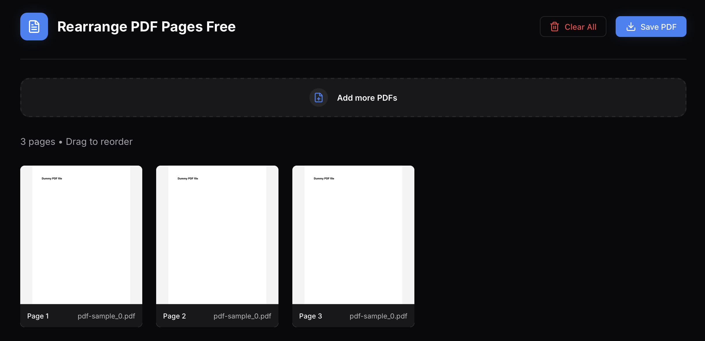

# Rearrange PDF Pages Free



A free, privacy-focused web app for rearranging, merging, and editing PDF pages. All processing happens entirely in your browser—no uploads, no servers, no data collection.

## Features

- 📄 **Upload multiple PDFs** and combine them into one document
- 🔄 **Drag and drop** to reorder pages
- 🗑️ **Delete unwanted pages** with a single click
- 💾 **Download** your edited PDF instantly
- 🔒 **100% client-side** - your files never leave your device
- ⚡ **Fast and responsive** - built with Next.js and React

## Getting Started

### Development

```bash
npm install
npm run dev
```

Open [http://localhost:3000](http://localhost:3000) to see the app.

### Production

Deploy to Vercel with one click:

[](https://vercel.com/new/clone?repository-url=https://github.com/wsjwong/rearrange-pdf-pages-free)

## Tech Stack

- **Next.js 16** - React framework
- **pdf-lib** - PDF manipulation
- **react-pdf** - PDF rendering
- **@dnd-kit** - Drag and drop functionality
- **TypeScript** - Type safety

## License

MIT
